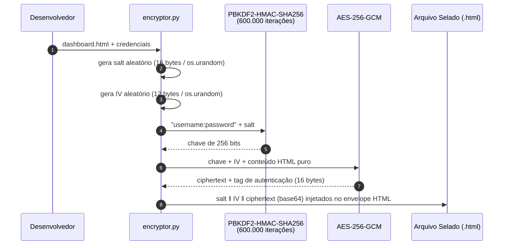
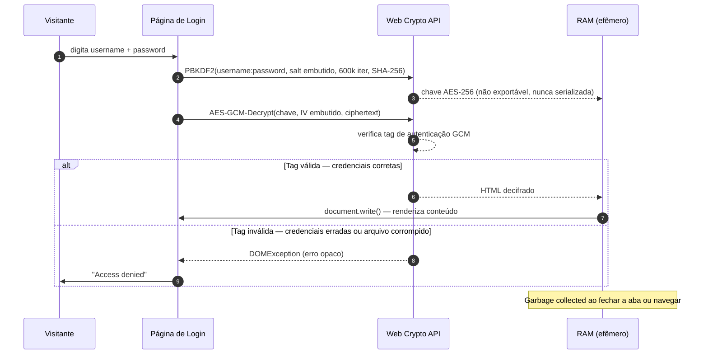
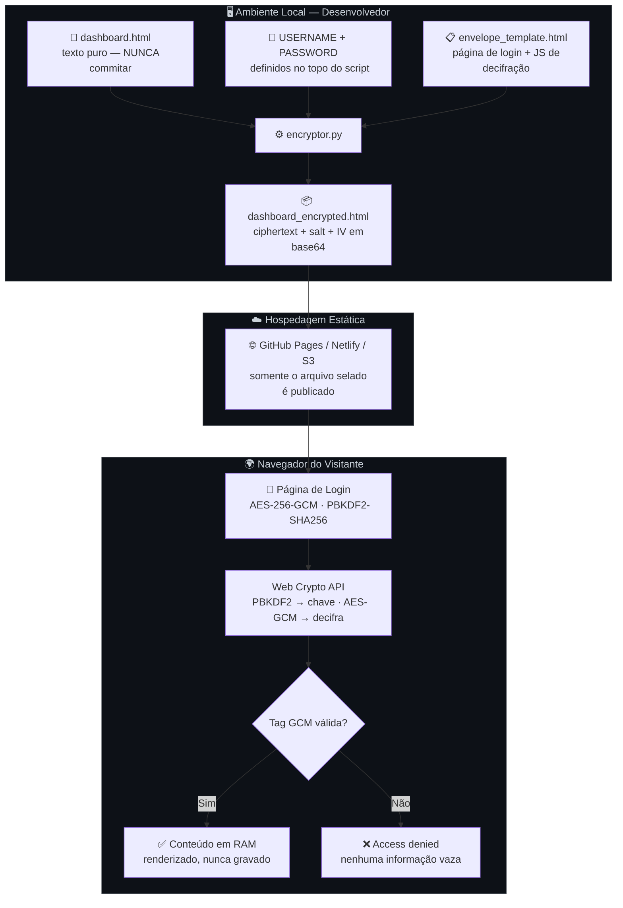

# Envelope HTML — AES-256-GCM

Protege dashboards HTML estáticos com criptografia autenticada, sem servidor, sem backend, sem texto puro exposto. A decifração ocorre inteiramente na RAM do navegador do visitante — e é descartada ao fechar a aba, ao contrário das suas dívidas.*

<video src="https://raw.githubusercontent.com/GomesAdemir/Dashboard-encryptor/main/video_exemplo.mp4" controls width="100%"></video>

---S

## Índice

- [Como funciona](#como-funciona)
- [Arquitetura](#arquitetura)
- [Modelo de segurança](#modelo-de-segurança)
- [Senhas — a única linha de defesa](#senhas--a-única-linha-de-defesa)
- [Instalação](#instalação)
- [Uso](#uso)
- [Deploy](#deploy)
- [Primitivas criptográficas](#primitivas-criptográficas)

---

## Como funciona

O sistema opera em duas fases completamente separadas e independentes:

**Fase 1 — Selagem (Python, ambiente local):** `encryptor.py` lê o dashboard em texto puro, deriva uma chave de 256 bits a partir das credenciais usando PBKDF2-HMAC-SHA256 com 600.000 iterações, e cifra o conteúdo com AES-256-GCM. O resultado é um único arquivo HTML com o ciphertext embutido em base64 — ininteligível sem a chave correta.

**Fase 2 — Abertura (Navegador, sob demanda):** O visitante digita as credenciais. O navegador replica a derivação de chave via Web Crypto API nativa e tenta decifrar. Se a tag de autenticação GCM for válida, o conteúdo é renderizado em memória. Se não for — acesso negado, sem mensagem de erro útil ao atacante, sem pistas.

### Fluxo de Criptografia



### Fluxo de Decifração (Navegador)



---

## Arquitetura



---

## Modelo de Segurança

### O que este sistema protege

| Ameaça | Proteção |
|---|---|
| Crawlers e scrapers lendo o código-fonte | O HTML publicado é ciphertext puro — ilegível sem a chave |
| Acesso direto ao arquivo hospedado | Sem credenciais corretas, o GCM rejeita qualquer tentativa de decifração |
| Adulteração do ciphertext por terceiros | A tag de autenticação GCM (16 bytes) detecta qualquer alteração — o arquivo não decifra |
| Reúso de IV (nonce) | Salt e IV são gerados com `os.urandom()` a cada selagem — colisão é astronomicamente improvável |
| Vazamento de credenciais pelo arquivo | Nenhuma credencial ou hash é armazenado no arquivo — a única prova é a tag GCM |

### O que este sistema NÃO protege

> Honestidade é uma virtude rara em documentação de segurança de software. Aqui vai a nossa.*

| Limitação | Motivo |
|---|---|
| **Força bruta offline** | O atacante baixa o arquivo e testa senhas localmente. 600.000 iterações PBKDF2 encarecem cada tentativa, mas não tornam o ataque impossível. **A resistência real é a força da senha.** |
| **Máquina comprometida do usuário** | Keyloggers, extensões maliciosas e capturas de tela operam antes da criptografia entrar em cena |
| **Compartilhamento de credenciais** | Criptografia não resolve problemas humanos de gestão de acesso |
| **Metadados de tamanho** | O volume do arquivo criptografado pode revelar aproximadamente o tamanho do conteúdo original |
| **Usuário autenticado legítimo** | Quem decifra o conteúdo pode copiá-lo. Não existe proteção contra o destinatário intencional |

---

## Senhas — a única linha de defesa

O modelo de segurança deste sistema depende diretamente da força da senha. AES-256 é matematicamente irrelevante se a senha for `admin123` — o atacante não precisa atacar a criptografia, só precisa adivinhar. É como instalar uma porta blindada e deixar a chave embaixo do tapete.*

### Por que 600.000 iterações?

O PBKDF2 com 600.000 iterações força cada tentativa de senha a executar 600.000 rounds de SHA-256. Com hardware moderno (GPU dedicada), um atacante consegue testar aproximadamente **2–5 milhões de candidatas por segundo**. Isso parece muito — até você ver o que acontece com senhas fracas:

```
Senha: "admin"          →  espaço de busca trivial  →  < 1 segundo
Senha: 8 chars lowercase →  ~200 bilhões combinações →  minutos a horas
Senha: 12 chars mixed    →  ~10²¹ combinações        →  décadas
Frase com 4+ palavras    →  ~10³⁰+ combinações       →  tempo geológico
```

### Requisitos mínimos recomendados

- **Comprimento:** mínimo 16 caracteres
- **Complexidade:** mistura de letras maiúsculas, minúsculas, números e símbolos
- **Unicidade:** exclusiva para este sistema — nunca reutilizada em outro lugar
- **Armazenamento:** gerenciador de senhas (Bitwarden, 1Password, KeePass) — nunca em texto puro

### O que absolutamente evitar

```
❌  admin, senha, password, 123456, qwerty
❌  Nome do projeto, nome da empresa, nome próprio
❌  Datas de nascimento ou datas comemorativas
❌  Qualquer sequência que você consiga lembrar sem esforço
```

> Se a sua senha faz sentido para um ser humano, ela provavelmente consta em algum dicionário de ataque. As GPUs não se cansam.*

---

## Instalação

```bash
# Crie e ative o ambiente virtual
python3 -m venv .venv
source .venv/bin/activate      # Linux / macOS
# .venv\Scripts\activate       # Windows

# Instale a dependência
pip install cryptography
```

---

## Uso

### 1. Configurar credenciais e arquivos

Edite as constantes no topo de `encryptor.py`:

```python
USERNAME   = "seu_usuario"          # identidade da credencial
PASSWORD   = "SuaSenhaForte!#9xK"   # veja seção de senhas acima
ITERATIONS = 600_000                # não reduza sem motivo documentado

FILE_IMPUT  = "dashboard.html"            # arquivo a ser selado
FILE_OUTPUT = "dashboard_encrypted.html"  # arquivo de saída
```

### 2. Selar o dashboard

```bash
# Usa FILE_IMPUT e FILE_OUTPUT definidos no script
python3 encryptor.py

# Ou passe o arquivo diretamente como argumento posicional
python3 encryptor.py meu_dashboard.html

# Especificando saída explicitamente
python3 encryptor.py meu_dashboard.html -o saida_final.html
```

### 3. Testar localmente

A Web Crypto API exige um **contexto seguro**. HTTP simples em IP de rede não funciona.

```bash
python3 -m http.server 8000
# Acesse: http://localhost:8000/dashboard_encrypted.html
```

---

## Deploy

1. Publique **somente** o arquivo `*_encrypted.html`. O arquivo original em texto puro **jamais deve ser commitado ou hospedado**.
2. O par `salt + IV` embutido no arquivo publicado é público por design — não são segredos. O único segredo é a senha.
3. Ao trocar as credenciais, re-execute o encryptor. O arquivo anterior fica permanentemente obsoleto (chaves diferentes).

### Verificação pós-deploy

```bash
# Confirme que nenhum conteúdo legível foi exposto
strings dashboard_encrypted.html | grep -i "palavra_do_original"
# → deve retornar vazio
```

---

## Primitivas Criptográficas

| Primitiva | Parâmetros | Finalidade |
|---|---|---|
| PBKDF2-HMAC-SHA256 | 600.000 iterações · salt 128-bit | Derivação de chave — encarece ataques de força bruta |
| AES-256-GCM | Chave 256-bit · IV 96-bit | Cifração autenticada — confidencialidade + integridade |
| `os.urandom()` | — | Geração criptograficamente segura de salt e IV |
| Web Crypto API | Nativa no navegador | Decifração client-side sem dependências externas |

---

> *As piadas estão marcadas com asterisco. A segurança, não.*
